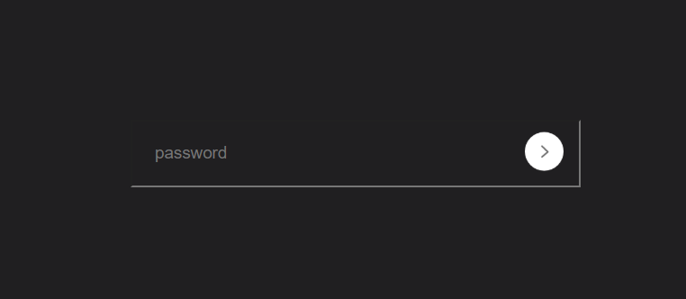

# 🔐 Password Strength Checker

A simple and responsive **Password Strength Checker** built using **HTML, CSS, and JavaScript**. As the user types a password, the application instantly checks its strength and changes the input border and message color based on the password length.

> 🚀 Beginner-friendly JavaScript project for practicing DOM manipulation and event handling.

---

## 📸 Project Screenshot

<p align="center">
  
</p>


---

## 🌐 Live Demo

🔗 **Live Website:** https://show-password-strength-rose.vercel.app/


---

## ✨ Features

- 🔑 Real-time password strength detection
- 🎨 Changes border color according to password strength
- 📢 Displays password strength message instantly
- 📱 Fully responsive design
- ⚡ Built using Vanilla JavaScript
- 💻 Beginner-friendly source code

---

## 🛠️ Technologies Used

- HTML5
- CSS3
- JavaScript (ES6)

---

## 📂 Folder Structure

```
Password-Strength-Checker/
│
├── index.html
├── style.css
├── script.js
├── arrow.png
├── screenshot.png
└── README.md
```

---

## 🚀 Getting Started

### Clone the Repository

```bash
git clone https://github.com/bs-bhaskar/show-password-strength.git
```

### Open the Project

Simply open the `index.html` file in your browser.

---

## 📖 How It Works

- User starts typing a password.
- The strength is checked based on password length.
- Password strength is classified as:

| Password Length | Strength |
|-----------------|----------|
| Less than 4 | 🔴 Weak |
| 4 - 7 | 🟡 Medium |
| 8 or more | 🟢 Strong |

The input border and message color change automatically according to the detected strength.

---

## 📚 What I Learned

- DOM Manipulation
- Event Listeners
- Input Events
- Conditional Statements
- Dynamic Styling using JavaScript
- Responsive Layout Design

---

## ⚠️ Known Issue

There are a few small mistakes in the current JavaScript code that should be fixed before deployment:

- `pass.Value` ➜ should be `pass.value`
- `border: ipx solid #ccc;` ➜ should be `border: 1px solid #ccc;`
- HTML is missing an element with `id="strength"`.

After fixing these issues, the project will work as expected.

---

## 👨‍💻 Author

**Bhaskar Yogi**

- GitHub: https://github.com/bs-bhaskar

---

## ⭐ Show Your Support

If you like this project, don't forget to **⭐ Star** the repository!

Happy Coding! 🚀